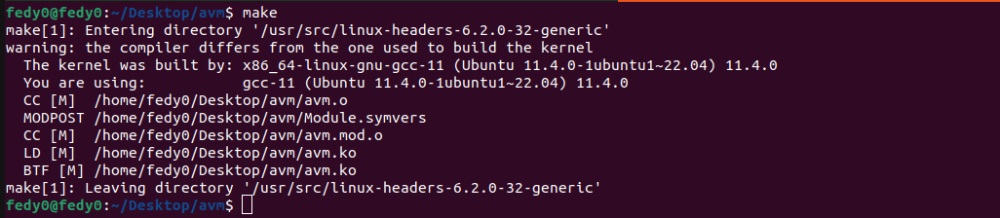
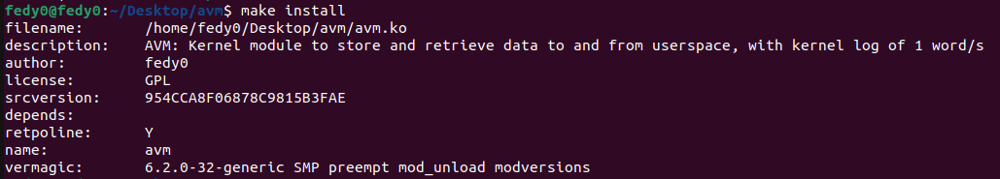
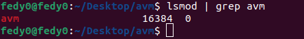
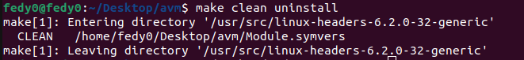
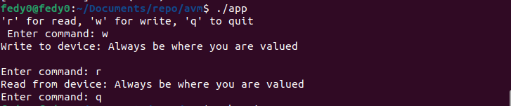
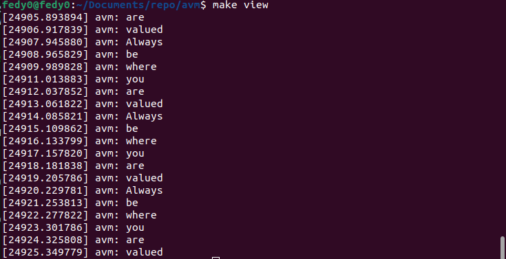

# avm
AVM Device: Linux Kernel Module

A dynamically loadable Linux kernel module is to be developed, which is built against the external kernel build interface and provides the following interfaces for the userspace.

The following kernel APIs are to be used Workqueue/Timer, List, Mutex/Semaphore.
1. When loading/unloading the module, a corresponding log message should appear in the kernel log.
2. Data exchange with the userspace: an interface should be created which:
    1. accepts text data from the userspace and stores it in a dynamic internal memory.
    2. return text data from the internal memory to the userspace
3. Using the kernel API:
    1. the text data from the internal memory shall be written regularly, 1 word per second, to the kernel log.

The result should be provided as a git repo with source file and kernel log.
You are free to choose the Linux kernel release (4.9.x, 5.4.x, 5.18.x, etc) and the target environment (standard Linux desktop, emulated or embedded system).

If it is your first kernel module, LDD3 is a good place to start.

## Download
You can download the project zip and unzip it or you can clone the project as shown below
```bash
git clone https://github.com/fedy0/avm.git
```

## Build Module & Compile Test Application
The project includes the module driver `avm.c` and a test application `app.c` used to read and write into the avm character device.
By running `make`, the module is built and the application executable is generated too.
Note that you have to either modify the `Makefile` to add your system passpharse or you add it as an argument to `make` as shown below.
```bash
cd avm
make
```
or,
```bash
cd avm
make PASSPHRASE="Put your system passpharse"
```


## Installation
To install the module, simply run:
```bash
make install
```

<br>
<br>
You can confirm the installation by running `lsmod` with `grep` as shown below

<br>
<br>
To uninstall the module, simply run:
```bash
make uninstall
```


## Test
To test the module and application, execute:
```bash
./app
```


To see the kernel log messages, run:
```bash
make view
```
or,
```bash
sudo dmesg
```


## Clean
To delete all the generated binaries/file, run:
```bash
make clean
```

